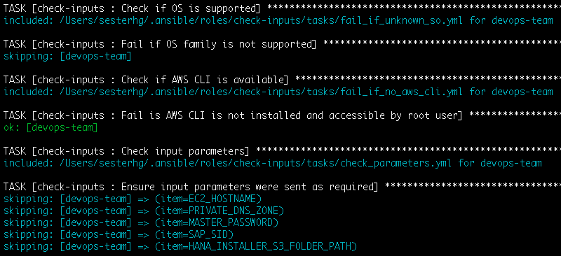

# Check inputs Ansible role

```
Copyright Amazon.com, Inc. or its affiliates. All Rights Reserved.
SPDX-License-Identifier: MIT-0
```

This is an Ansible playbook containing the "Check inputs" shared role that other playbooks use to install components of the SAP ecosystem

It has one main purposes:

1. Ensure that all needed variables for a playbook to run successfully were sent by the user. So if you have a variable that MUST be there for your playbook to run, use this role to check if the user sent it. If any of the listed vars under "input_variables_to_check" are not present, the playbook will fail with an according message pointing which variable isn't present

## How to use

On your main .yml file add:

```
- name: Check inputs
  become: yes
  hosts: all
  roles:
    - role: check-inputs
      vars:
        input_variables_to_check: 
          - MY_REQUIRED_VAR_1
          - MY_REQUIRED_VAR_2
          - EC2_HOSTNAME
          - MASTER_PASSWORD
          - SAP_SID
          - SAPMNT_EFS_ID
          - MY_S3_FOLDER_PATH
```

## Sample output

During run time on your Ansible output you should see an image like the one below:



This image states that 8 parameters were required and the command <code>"ansible-playbook"</code> sent them all successfully to your execution